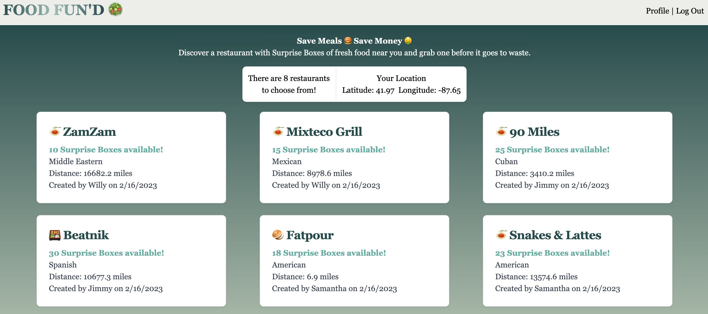

# Food Fun'd

With The Simple Lifers’ FoodFun’d, saving meals—and money—just got easier. 

Based on our user journey, we’ve created a responsive, interactive UI that allows users to add their own information regarding restaurants with Surprise Boxes of fresh food at a discounted price. 

We structured our folders with the MVC paradigm and build code based on clean, quality standards, building our own database using MySQL 2.0 and the Sequelize ORM. With Node.js and Express.js, we also created a RESTful API—leveraging both GET and POST routes for retrieving and adding new data. 

Our login/logout JS and handlebar files allow for authentication (both express-session and cookies)—using environment variables to protect API keys and sensitive information. 

In terms of new technology, we implement a geolocation navigator to get the user’s current position and a calCrow function to take in the latitude and longitude of two locations to return the distance between them (in km). Not to mention our own unique CLI command to generate a self-updating Tailwind CSS file. 

For a deeper understanding of how FoodFun’d works, here are the Acceptance Criteria we’ve established:

IF I visit the FoodFun’d homepage

THEN I’ll see a list of added restaurants that include their name, cuisine, location and Surprise Boxes (meals) available.

IF I visit the login page

THEN I’ll be given the option to log in as a returning user or sign up as a new one.

IF I return to the homepage as a logged in user

THEN I’ll have the option to visit a profile page.

IF I click on the profile page

THEN I’ll be able to add or delete a restaurant’s name, cuisine, location and # of Surprise Boxes (meals) available. 

IF I return to the homepage

THEN I’ll see an updated list of restaurants based on my latest activity.

Here’s a screenshot of our latest and greatest:

To discover your own way to save meals, money and the planet, check out FoodFun’d [here](https://foodfund.herokuapp.com/).